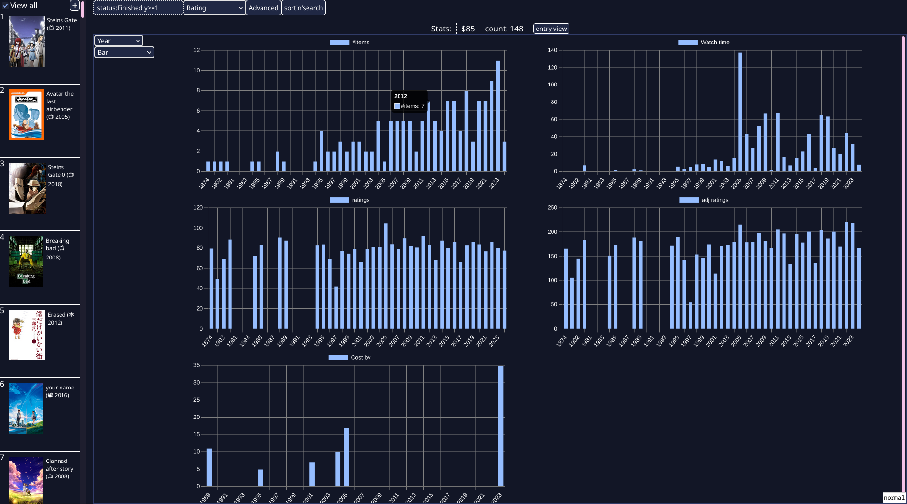

# The **A**ll **I**n **O**ne **Li**brary **Ma**gement **S**ystem

### AIO LIMAS For short




### The Point

I made this program because i had a system for managing which shows/movies i had watched/planned,

And I had another system for keeping track of how much I've spent on Manga, DVDS, and the like.

I realized that I could make a program that combines both of these problems into one massive
inventory management thingy

For some extra challenge, I also want to support as many media types as possible on as many
formats as possible

example formats:
xbox 360
digital
blu ray
dvd

example media types:
Movie
Show
Manga
Book
Game
BoardGame
Song

### Running


> [!IMPORTANT]
Be sure to export the ACCOUNT_NUMBER env var
This is used as the login password
(plans to disable this by default)


> [!TIP]
To use the omdb provider, get an omdb key and export the OMDB_KEY variable


> [!NOTE]
Only tested on linux

```bash
git clone https://github.com/euro20179/aio-limas

cd aio-limas

go run .
```

A server and web ui will then be running on `localhost:8080`


### Docs
Basic documentation can be found at `/docs`

### TODO

- [x] enable/disable children/copies
- [ ] steam account linking
- [x] image media type
    - [ ] when fetching metadata, use ai to generate a description of the image
- [x] search by description
- [x] disable ACCOUNT_NUMBER by default
- [ ] documentation
    - [x] webservice
    - [ ] ui
- [ ] edit info/user/meta tables from ui
    - [x] info
    - [ ] meta
    - [ ] user
- [x] calc mode
- [ ] proper search parser
    - on the server there could be something that parses some language like:
        - `rating > 90 && (rating < 95 || en_title ~ "this is a neat title%")`
        - special syntax where `{...}` is left alone, and passed directly to sqlite as an expression
            - eg: `{rating/ratingMax * 100} > 90`
    - make a new api query-v3, the sole parameter is a query in the form of that language
    - the server will try to parse it, if it fails to parse, it is treated as:
    `en_title ~ "<the query>"`
    - [x] partial, support &&, ||, and various comparison operators, unordered
- [ ] collection stat calculation modifier
- [ ] Have the ui only display items that are part of a collection
