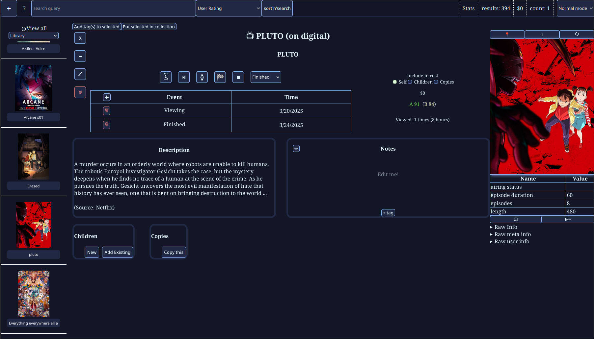

# The **A**ll **I**n **O**ne **Li**brary **Ma**gement **S**ystem

> [!NOTE]
This software is written for me and me foremost, so a lot of things are very how-i-would-do-them.
The most notable of which is how search works.


### AIO LIMAS For short




### The Point

I made this program because i had a system for managing which shows/movies i had watched/planned,

And I had another system for keeping track of how much I've spent on Manga, DVDS, and the like.

I realized that I could make a program that combines both of these problems into one massive
inventory management thingy

For some extra challenge, I also want to support as many media types as possible on as many
formats as possible

example formats:
xbox 360
digital
blu ray
dvd

example media types:
Movie
Show
Manga
Book
Game
BoardGame
Song

### Running

> [!TIP]
To use the omdb provider, get an omdb key and export the OMDB_KEY variable


> [!NOTE]
Only tested on linux

```bash
git clone https://github.com/euro20179/aio-limas

cd aio-limas

go run .
```

A server and web ui will then be running on `localhost:8080`


### Configuration

By default things are stored in `$AIO_DIR` which by default is `$XDG_DATA_HOME/aio-limas`

For sonarr/radarr integration, create a file called settings.json and add the following:
```json
{
    "SonarrKey": "<YOUR SONARR API KEY>"
    "SonarrURL": "http://url-for-sonar:8989",
    "RadarrKey": "<YOUR RADARR API KEY>"
    "RadarrURL": "http://url-for-radarr:7878"
}
```

### Styling

Styles can always be overridden by your choice (eg userStyles.css in firefox).

But i've also tried to make it easy to override colors. Please see `webservice/www/css/colors.css` for a list of variables that can be overridden.

### Docs
Basic api documentation can be found at `/docs`

Basic user facing docs can be found at `/usage`

### TODO

- [x] enable/disable children/copies
- [ ] steam account linking
- [ ] Video game metadata provider
- [ ] ability to save data: thumbnail urls as seperate files on the download-thumbnail endpoint
- [x] image media type
    - [ ] when fetching metadata, use ai to generate a description of the image
- [x] search by description
- [x] disable ACCOUNT_NUMBER by default
- [ ] documentation
    - [x] webservice
    - [ ] ui
- [x] edit info/user/meta tables from ui
    - [x] info
    - [x] meta
    - [x] ~user~ *decided against, as you can already edit everything anyway*
- [x] calc mode
- [x] proper search parser
- [ ] ~collection stat calculation modifier~
- [ ] requires
     - an id that should be viewed before this entry
     - eg: `starwars 2` requires `starwars 1`
     - if an entry requires more than 1 entry, make a collection containing all the requirements
- [x] In thee ui, in graph mode, allow the user to write a function of some kind to determine how the grouping will work, isntead of the predetermined year/item name/tags etc...
    - the user's function should return a string for each item indicating which group it's in

- [ ] refactor the json metadata fields into their own tables
    for example, Shows have json that looks like `{"Show-episode-length": 49}`, etc...
    instead, have a table for each type, such as a Show table
    in the Show table there will be columns relevant to shows
    episode-length episodes, length, airing-status, etc...
    the primary key will be the ItemId

- [ ] refactor `settings.json` instead of having that one global file:
    there should be a table in accounts.db called like `settigns` or something
    it contains the same information as `settings.json` but for each user
